# projectDemo

#### Description
这是自己的项目框架，里面一些UI封装

第一个bannerlib项目lib：
里面是两种常用效果的轮播图

 - Screenshots
    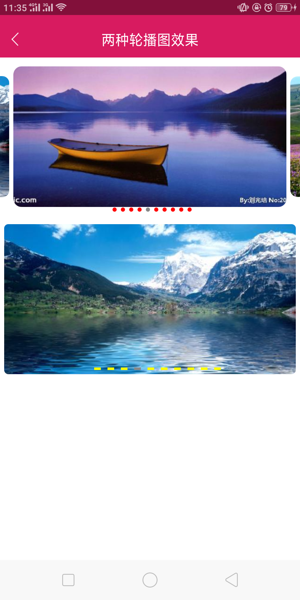

第二个bspopupwindow项目lib：
是弹框菜单（可一级菜单，二级菜单，多级菜单），
一般项目最多二级菜单即可实现
 - Screenshots
    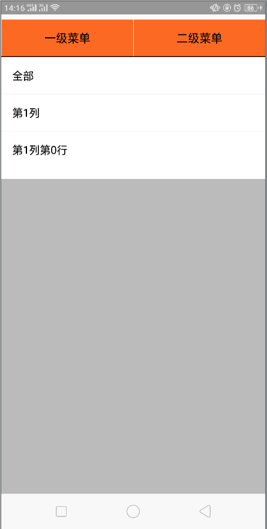 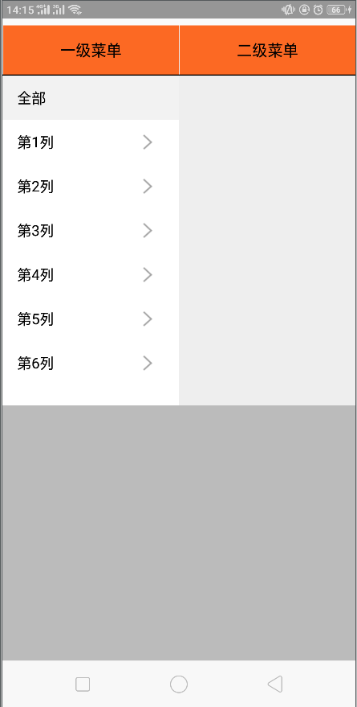

第三个EditTvLibrary项目lib：
主要是自定义EditText，自动提示语功能，有的项目需要，则直接使用即可
- Screenshots
    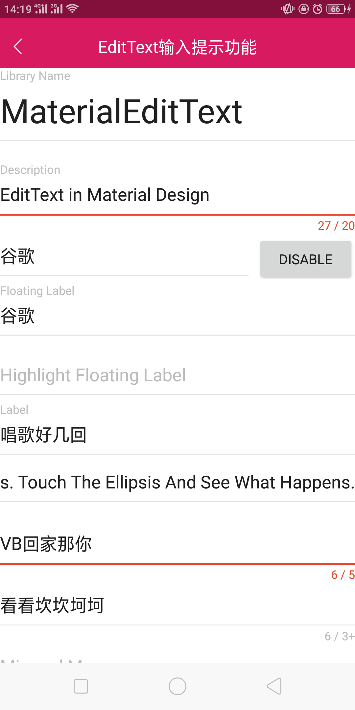

第四个FJDropDownMenuLib项目lib：
这个也是多级菜单实现,是在网上找的，他人写的一款，用起来也应该很不错
- Screenshots
    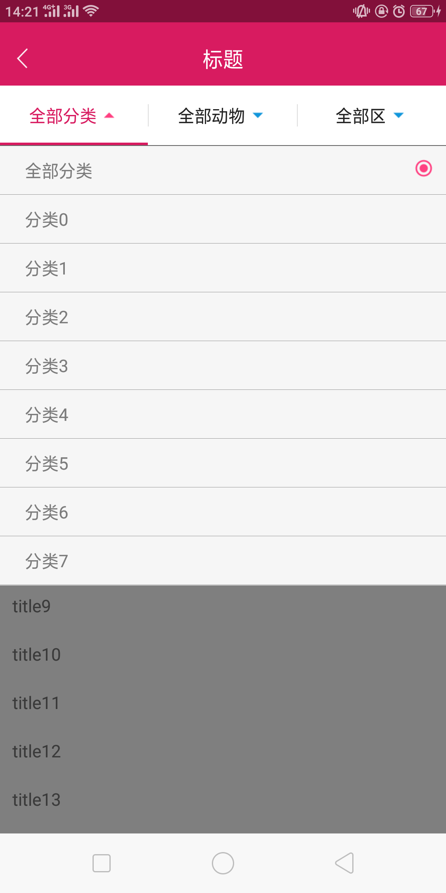
    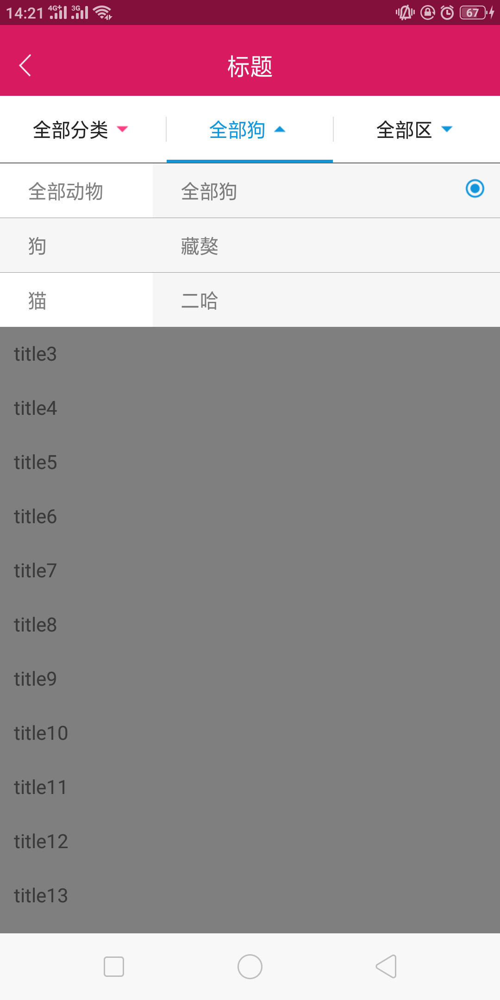
    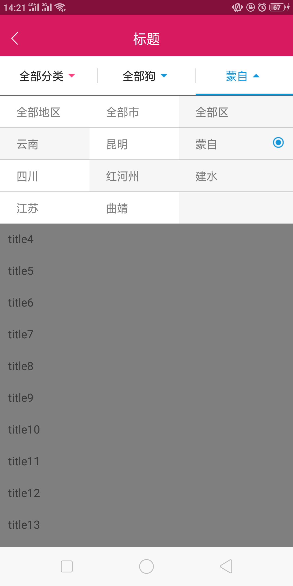

第五个 FlycoTabLayout_Lib项目lib：
里面有几种TabLayout样式，没特别要求，里面几种效果最佳，用户体验很不错
- Screenshots
  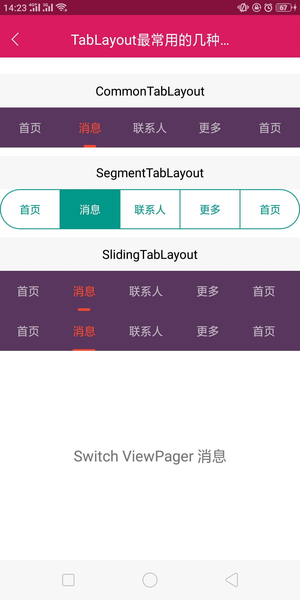

第六、mylocation 项目lib：
直接实现了地图定位以及地图显示位置以及附近地名的一些信息、地址搜索列表，
可根据需求自己修改搜索目标，可实现城市选择，
- Screenshots
  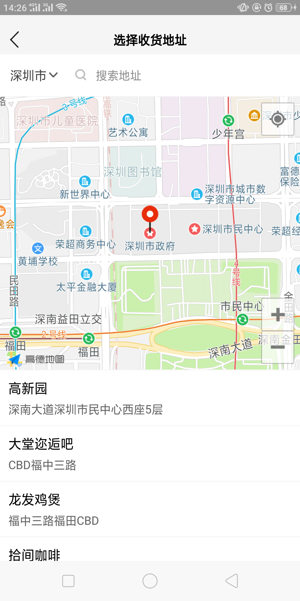
  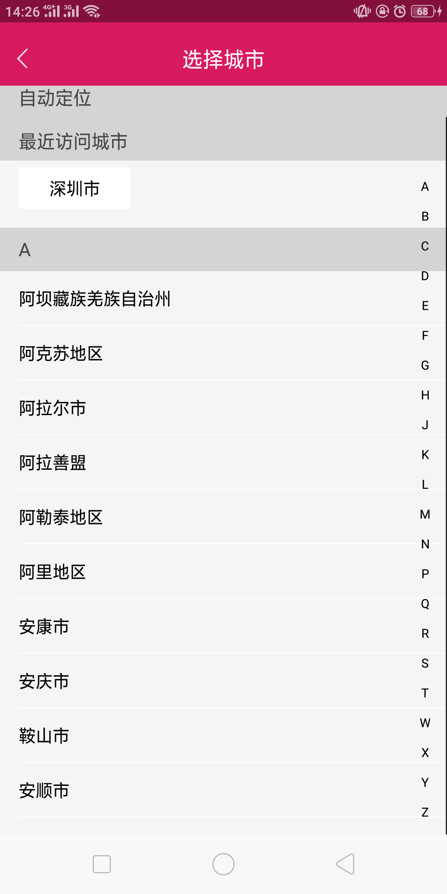

第七、mypicturelibrary项目lib：
这个主要是自己封装的一个图片预览的功能，可一张、可多张图片预览，图片可放大缩小
，有滑动，有长按事件，有下载功能，
- Screenshots
 

第八、refreashlayout项目Lib:
把RefreshLayout刷新控件可RecyclerView列表控件封装一起，可直接使用布局，从数据加载、成功、失败、各种情况判断都会有

第九、textviewlib项目Lib：
因很多时候都出现静态列表或动态列表，（不过如果是动态列表需要和接口配合，在我另一个表单布局封装里面），列表里面有ImageView 、 TextView、 EditText三个UI组成 TextView是标题和EditText内容，
内容要么是可编辑要么是不可编辑，列表是否可点击功能，前后是否有图标，
等等一系列的属性都做了封装，如果遇到列表或者一行，都可以使用，非常的方便
  <com.tv.lib.MenuItemLayout
             android:id="@+id/add_phone_tv"
             android:layout_width="match_parent"
             android:layout_height="@dimen/my50dp"
             android:background="@color/white"
             app:content_color="@color/black"
             app:content_eable="true"
             app:content_gray="left"
             app:content_inputType="phone"
             app:hint_text="请输入手机号"
             app:show_right_icon="false"
             app:show_title_icon="false"
             app:title_color="@color/black"
             app:maxlength="11"
             app:title_text="手机号" />

- Screenshots
 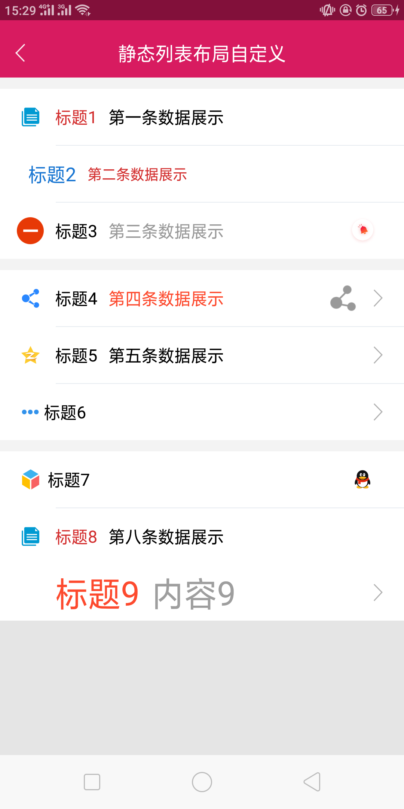

#### Gitee Feature

1. You can use Readme\_XXX.md to support different languages, such as Readme\_en.md, Readme\_zh.md
2. Gitee blog [blog.gitee.com](https://blog.gitee.com)
3. Explore open source project [https://gitee.com/explore](https://gitee.com/explore)
4. The most valuable open source project [GVP](https://gitee.com/gvp)
5. The manual of Gitee [https://gitee.com/help](https://gitee.com/help)
6. The most popular members  [https://gitee.com/gitee-stars/](https://gitee.com/gitee-stars/)